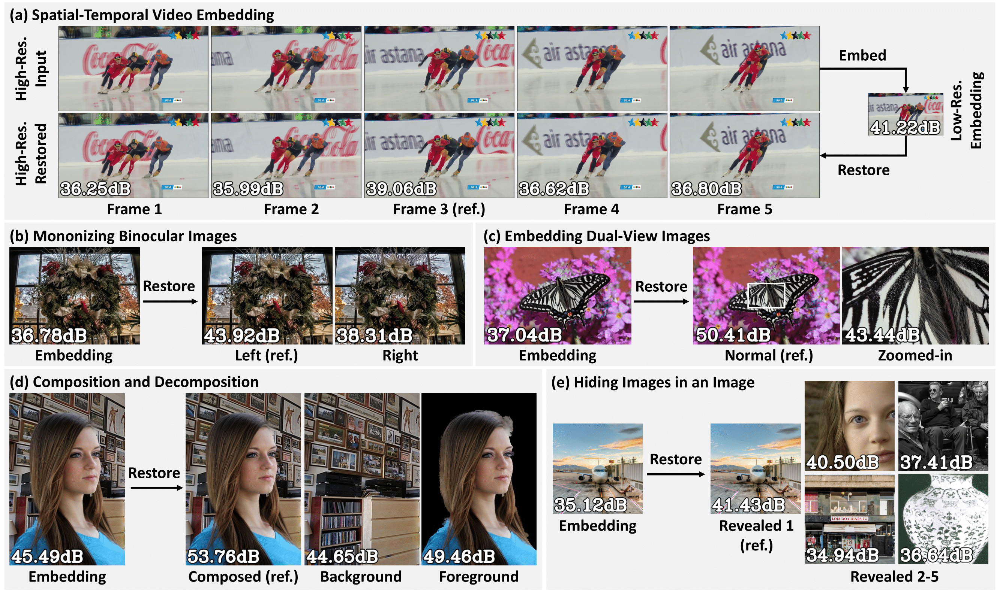

# IICNet - Invertible Image Conversion Net

**Official PyTorch Implementation for [IICNet: A Generic Framework for Reversible Image Conversion (ICCV2021)](https://arxiv.org/abs/2109.04242).** 

**External Links: [Pre-recorded Video](https://www.youtube.com/watch?v=Dji2iC_hUfo&t=225s) | [Demo Video](https://www.youtube.com/watch?v=Hwj05IrdUAo) | [Supplements](https://klchengad.student.ust.hk/research/iccv-iicnet/iicnet-supp.pdf)** 




## Introduction
Reversible image conversion (RIC) aims to build a reversible transformation between specific visual content (e.g., short videos) and an embedding image, where the original content can be restored from the embedding when necessary. This work develops Invertible Image Conversion Net (IICNet) as a generic solution to various RIC tasks due to its strong capacity and task-independent design. Unlike previous encoder-decoder based methods, IICNet maintains a highly invertible structure based on invertible neural networks (INNs) to better preserve the information during conversion. We use a relation module and a channel squeeze layer to improve the INN nonlinearity to extract cross-image relations and the network flexibility, respectively. Experimental results demonstrate that IICNet outperforms the specifically-designed methods on existing RIC tasks and can generalize well to various newly-explored tasks. With our generic IICNet, we no longer need to hand-engineer task-specific embedding networks for rapidly occurring visual content.


## Installation
This repository is developed based on a Linux machine with the following:
* Ubuntu 18.04.3
* NVIDIA-SMI 440.33.01
* Driver Version: 440.33.01
* CUDA Version: 10.2
* GPU: GeForce RTX 2080 Ti

Clone this repository and set up the environment.
```bash
git clone https://github.com/felixcheng97/IICNet.git
cd IICNet/
conda env create -f iic.yml
conda activate iic
```

As requested, we also prepare a requirements.txt file for pip install.
```bash
git clone https://github.com/felixcheng97/IICNet.git
cd IICNet/
conda create --name iic python=3.5
conda activate iic
pip install --upgrade pip
pip install -r requirements.txt
```

## Dataset Preparation
We conduct experments on 5 multiple-and-single RIC tasks in the main paper and 2 single-and-single RIC tasks in the supplements. Note that all the datasets are placed under the `./datasets` directory.


### Task 1: Spatial-Temporal Video Embedding
We use the high-quality DAVIS 2017 video dataset in this task. You could download the *Semi-supervised 480p* dataset through this [link](https://davischallenge.org/davis2017/code.html). Unzip, rename, and place them under the dataset directory with the following structure.
```
.
`-- datasets
    |-- Adobe-Matting
    |-- DAVIS-2017
    |   |-- DAVIS-2017-test-challenge (rename the DAVIS folder from DAVIS-2017-test-challenge-480p.zip)
    |   |-- DAVIS-2017-test-dev       (rename the DAVIS folder from DAVIS-2017-test-dev-480p.zip)
    |   `-- DAVIS-2017-trainval       (rename the DAVIS folder from DAVIS-2017-trainval-480p.zip)
    |-- DIV2K
    |-- flicker
    |-- flicker1024
    |-- Real-Matting
    `-- VOCdevkit
```

Then run the following scripts for annotation.
```bash
cd codes/scripts
python davis_annotation.py
```

### Task 2: Mononizing Binocular Images
We use the Flickr1024 dataset with the official train and test splits in this task. You could download the dataset through this [link](https://yingqianwang.github.io/Flickr1024/). Place the dataset under the dataset directory with the following structure.
```
.
`-- datasets
    |-- Adobe-Matting
    |-- DAVIS-2017
    |-- DIV2K
    |-- flicker
    |-- flicker1024
    |   |-- Test
    |   |-- Train_1
    |   |-- Train_2
    |   |-- Train_3
    |   |-- Train_4
    |   `-- Validation
    |-- Real-Matting
    `-- VOCdevkit
```

Then run the following scripts for annotation.
```bash
cd codes/scripts
python flicker1024_annotation.py
```

### Task 3: Embedding Dual-View Images
We use the DIV2K dataset in this task. You could download the dataset through this [link](https://data.vision.ee.ethz.ch/cvl/DIV2K/). Download the corresponding datasets and place them under the dataset directory with the following structure.
```
.
`-- datasets
    |-- Adobe-Matting
    |-- DAVIS-2017
    |-- DIV2K
    |   |-- DIV2K_train_HR
    |   |-- DIV2K_train_LR_bicubic
    |   |   |-- X2
    |   |   |-- X4
    |   |   |-- X8
    |   |-- DIV2K_valid_HR
    |   `-- DIV2K_valid_LR_bicubic
    |       |-- X2
    |       |-- X4
    |       `-- X8
    |-- flicker
    |-- flicker1024
    |-- Real-Matting
    `-- VOCdevkit
```

Then run the following scripts for annotation.
```bash
cd codes/scripts
python div2kddual_annotation.py
```

### Task 4: Embedding Multi-Layer Images / Composition and Decomposition
We use the Adobe Deep Matting dataset and the Real Matting dataset in this task. You could download the Adobe Deep Matting dataset according to their instructions through this [link](https://github.com/foamliu/Deep-Image-Matting-PyTorch). You could download the Real Matting dataset on its official [GitHub](https://github.com/senguptaumd/Background-Matting) page or through this direct [link](https://drive.google.com/drive/folders/1j3BMrRFhFpfzJAe6P2WDtfanoeSCLPiq). Place the downloaded datasets under the dataset directory with the following structure.
```
.
`-- datasets
    |-- Adobe-Matting
    |   |-- Addobe_Deep_Matting_Dataset.zip
    |   |-- train2014.zip
    |   |-- VOC2008test.tar
    |   `-- VOCtrainval_14-Jul-2008.tar
    |-- DAVIS-2017
    |-- DIV2K
    |-- flicker
    |-- flicker1024
    |-- Real-Matting
    |   |-- fixed-camera
    |   `-- hand-held
    `-- VOCdevkit
```

Then run the following scripts for annotation.
```bash
cd codes/scripts

# process the Adobe Matting dataset
python adobe_process.py
python adobe_annotation.py

# process the Real Matting dataset
python real_process.py
python real_annotation.py
```

### Task 5: Hiding Images in an Image
We use the Flicker 2W dataset in this task. You could download the dataset on its official GitHub page through this [link](https://github.com/liujiaheng/CompressionData). Place the unzipped dataset under the datasets directory with the following structure.
```
.
`-- datasets
    |-- Adobe-Matting
    |-- DAVIS-2017
    |-- DIV2K
    |-- flicker
    |   `-- flicker_2W_images
    |-- flicker1024
    |-- Real-Matting
    `-- VOCdevkit
```

Then run the following scripts for annotation.
```bash
cd codes/scripts
python flicker_annotation.py
```

### Task 6 \(supp\): Invertible Grayscale
We use the VOC2012 dataset in this task. You could download the *training/validation* dataset through this [link](http://host.robots.ox.ac.uk/pascal/VOC/voc2012/index.html). Place the unzipped dataset under the datasets directory with the following structure.
```
.
`-- datasets
    |-- Adobe-Matting
    |-- DAVIS-2017
    |-- DIV2K
    |-- flicker
    |-- flicker1024
    |-- Real-Matting
    `-- VOCdevkit
        `-- VOC2012
```

Then run the following scripts for annotation
```bash
cd codes/scripts
python voc2012_annotation.py
```

### Task 7 \(supp\): Invertible Image Rescaling
We use the DIV2K dataset in this task. Please check *Task 3: Embedding Dual-View Images* to download the corresponding dataset. Then run the following scripts for annotation.
```bash
cd codes/scripts
python div2ksr_annotation.py
```

## Training
To train a model for a specific task, run the following script:
```bash
cd codes
OMP_NUM_THREADS=4 python train.py -opt ./conf/train/<xxx>.yml
```

To enable distributed training with multiple GPUs for a specific task, simply assign a list of *gpu_ids* in the yml file and run the following script. Note that since training with multiple GPU is not tested yet, we suggest to train a model with a single GPU.
```bash
cd codes
OMP_NUM_THREADS=4 python -m torch.distributed.launch --nproc_per_node=4 --master_port 29501 train.py -opt ./conf/train/<xxx>.yml
```

## Testing
We provide our trained models in our paper for your reference. Download all the pretrained weights of our models from [Google Drive](https://drive.google.com/drive/folders/1Z-cGJLjqwh5kXFDTx8UerNyUfafLH0v8?usp=sharing) or [Baidu Drive](https://pan.baidu.com/s/1tUPGMn2MqiFe1d3l84ufyQ) (extraction code: e377). Unzip the zip file and place pretrained models under the `./experiments` directory.

To test a model for a specific task, run the following script:
```bash
cd codes
OMP_NUM_THREADS=4 python test.py -opt ./conf/test/<xxx>.yml
```

## Acknowledgement
Some codes of this repository benefit from [Invertible Image Rescaling (IRN)](https://github.com/pkuxmq/Invertible-Image-Rescaling.git).


## Citation
If you find this work useful, please cite our paper:
```
@inproceedings{cheng2021iicnet,
    title     = {IICNet: A Generic Framework for Reversible Image Conversion}, 
    author    = {Ka Leong Cheng and Yueqi Xie and Qifeng Chen},
    booktitle = {Proceedings of the IEEE/CVF International Conference on Computer Vision},
    year      = {2021},
    pages     = {1991--2000}
}
```

## Contact
Feel free to open an issue if you have any question. You could also directly contact us through email at klchengad@connect.ust.hk (Ka Leong Cheng) and yxieay@connect.ust.hk (Yueqi Xie).
